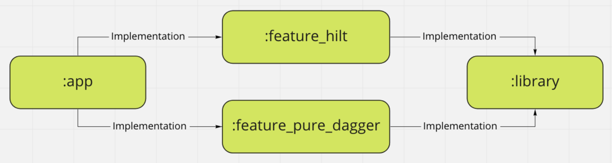

# HiltHack
Demo project for article  
“How to include external Dagger component into Hilt subcomponent hierarchy like as «component dependency» approach?”

Project structure
--------
  
*:app* - Main module  
*:feature_hilt* and *:feature_pure_dagger* - Modules with the same business logic but just different way of Dagger/Hilt usage  
*:library* - Any library which is used by *:feature_** module

Work-around
--------
The main goal of demo is to show how include independent external Dagger component into Hilt hierarchy.
The component named *PureDaggerFeatureComponent* is located in *:feature_pure_dagger* and work-around named *PureDaggerFeatureProxyModule* is located in *:app* module.
```kotlin
// :feature_pure_dagger module
@Singleton
@Component(modules = [PureDaggerFeatureModule::class])
interface PureDaggerFeatureComponent {
    fun someFeature(): PureDaggerSomeFeature
}
```

```kotlin
// :app module
@Module
@InstallIn(SingletonComponent::class)
internal class PureDaggerFeatureProxyModule {

    // Pass as method args any dependencies from :app you need to build component
    @Singleton
    @Provides
    fun pureDaggerFeatureComponent(): PureDaggerFeatureComponent {
        return DaggerPureDaggerFeatureComponent.builder().build()
    }

    // Use someFeature in Hilt
    @Provides
    fun someFeature(pureDaggerFeatureComponent: PureDaggerFeatureComponent): PureDaggerSomeFeature {
        return pureDaggerFeatureComponent.someFeature()
    }
}
```

Reason to have independent component
--------
One reason to use component dependency approach may be solve compilation error problem when you use Hilt across your modules.
You can read more about the problem and solution in article [Lock your Dagger in Gradle Modules](https://proandroiddev.com/lock-your-dagger-in-gradle-modules-e4270d61e138). To see the error with your own eyes go to *MainActivity* and uncomment injected field:
```kotlin
@AndroidEntryPoint
class MainActivity : AppCompatActivity(R.layout.acitivity_main){

    @Inject
    lateinit var pureDaggerSomeFeature: PureDaggerSomeFeature

    // One possible reason to use component-dependency approach
    // Uncomment to get compilation error
    // @Inject
    // lateinit var hiltSomeFeature: HiltSomeFeature
}
```
